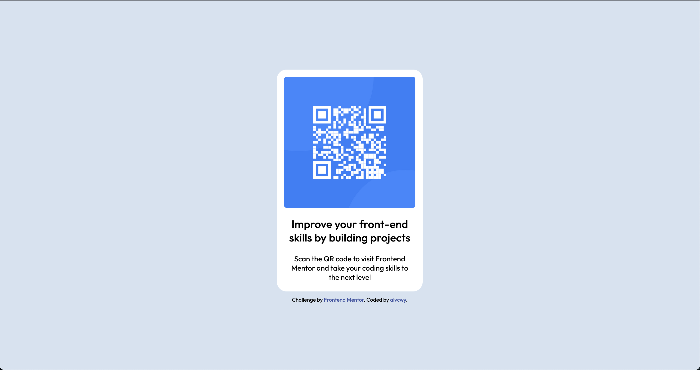

# Frontend Mentor - QR code component solution

This is my solution to the [QR code component challenge on Frontend Mentor](https://www.frontendmentor.io/challenges/qr-code-component-iux_sIO_H).

## Table of contents

- [Overview](#overview)
  - [Screenshot](#screenshot)
  - [Links](#links)
- [My process](#my-process)
  - [Built with](#built-with)
  - [What I learned](#what-i-learned)
  - [Continued development](#continued-development)

## Overview

### Screenshot

### Links

- Live at: [https://alvcwy.github.io/frontend-mentor-qr-code/](https://alvcwy.github.io/frontend-mentor-qr-code/)

## My process

### Built with

- HTML
- CSS

### What I learned

As someone with little experience on the frontend, this was a great starter project to work on my CSS. My main takeaways are:
- Creating a box with CSS (resize a div and give it a background color)
- Adapting CSS properties to work on both mobile and desktop
- Using Google Fonts instead of default HTML fonts

### Continued development

I will probably continue with other Frontend Mentor challenges and see how it goes from there. Thanks for checking this out!
